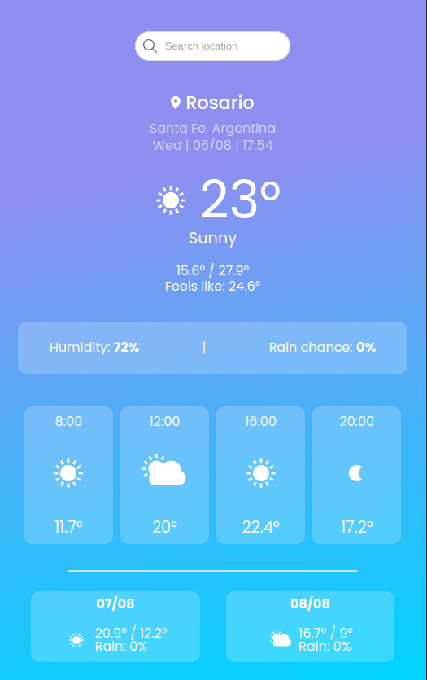
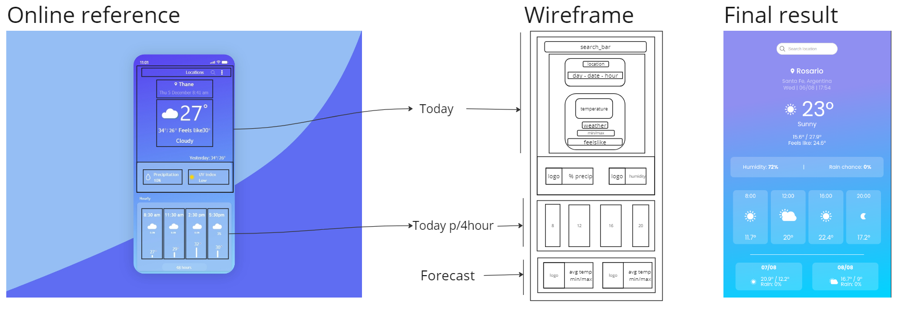

# Weather App

This is a simple weather app that uses the [WeatherApi](https://www.weatherapi.com/) to get the weather data for a given city. It uses the requests library to make the API call and the json library to parse the response. The app also uses the datetime library to get the current date and time.

### [Live Test](https://joaquinarruiz.github.io/weather-app/)

Project made with: [antelor](https://github.com/antelor)

## Project Screen Shot

### Responsive Design

## Process

